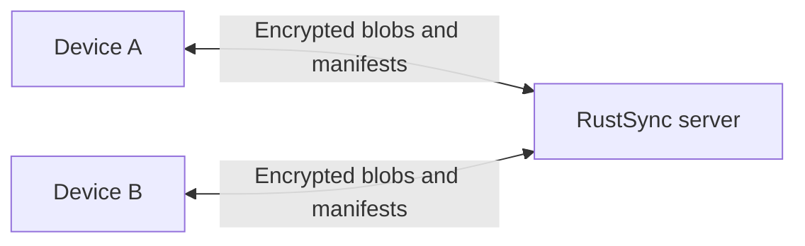
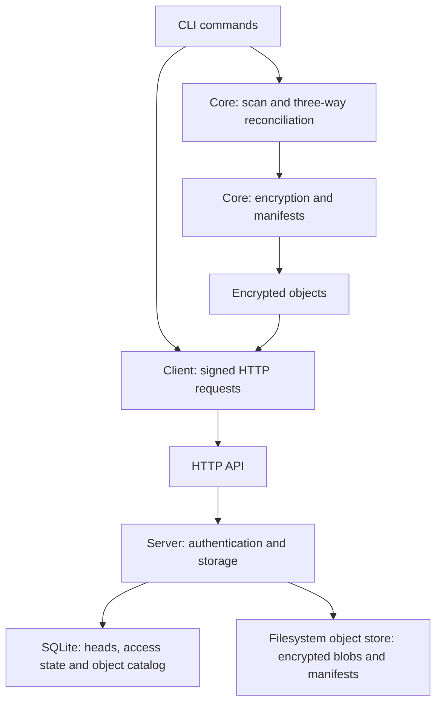

# RustSync

Sync a directory between your devices through a server you run. Files and
manifests are encrypted on each device before upload. The server stores the
encrypted objects and enforces device permissions.

Run `sync` when you want to exchange changes. RustSync propagates edits and
deletions, merges compatible text edits, and keeps conflicting versions for
you to resolve. Unchanged files keep their local modification times and reuse
their remote blobs.

RustSync is pre-release software. Keep an independent backup and read the
[limitations](#limitations) before using it for important files.

## How it works

The CLI scans a workspace, compares local and remote manifests against the last
synchronized base, and uploads or downloads encrypted objects. The core library
handles encryption, local state, and reconciliation; the client library handles
HTTP requests. The server stores encrypted blobs on disk and tracks workspace
heads and device access in SQLite. A shared protocol crate defines the wire types.





## Security and threat model

Devices encrypt file contents and manifests with XChaCha20-Poly1305 before
upload. The server has no plaintext workspace keys and cannot decrypt contents
or paths. It does see workspace and device identities, object sizes, and timing.

Authenticated workspace requests carry Ed25519 signatures covering the method,
path, body hash, device ID, timestamp, and nonce. The server rejects timestamps
outside a five-minute window and tracks used nonces in memory. Replay tracking
resets on restart; malicious-server rollback protection is incomplete.

Owners approve device enrollment and deliver encrypted workspace keys. Compare
device fingerprints through a trusted channel before approval. Revocation blocks
future authorized server access, but cannot erase downloaded data or keys and
does not rotate the shared workspace key.

Compromised endpoints, plaintext local storage, traffic analysis, denial of
service, and a malicious server withholding or rolling back state are outside
the current protection guarantees. Local files, caches, and keys remain readable
on the device. Use HTTPS or a private tunnel beyond localhost. See the full
[security model](docs/security.md) for details.

## Run with Docker

With Docker Engine and the Compose plugin installed, run from the repository root:

```sh
docker compose up -d
curl --fail http://127.0.0.1:3000/health
```

The first command builds the server image and starts it at
`http://127.0.0.1:3000`, the default client URL. The image runs as UID/GID 10001,
and the `server-data` named volume retains SQLite state and encrypted objects
across container replacement. Only localhost can reach the published port.
The image health check tests HTTP availability, not every stored object.

```sh
docker compose logs server
docker compose down                 # Stop containers; retain the data volume.
docker compose up -d --build        # Rebuild after updating the source.
```

`docker compose down --volumes` deletes the stored server data. Stop the server
before backing up the complete volume; see [backup and restore](docs/server.md#backup-and-restore).
For remote access, put HTTPS or a private tunnel in front of the HTTP listener.
[examples/docker-compose.yml](examples/docker-compose.yml) provides the same
setup with a build context relative to the examples directory. Run either Compose
file, since both publish port 3000 and use separate project volumes by default.

## Try it locally

You need stable Rust, Cargo, and a native compiler toolchain. From the repository
root, start the server in one terminal:

```sh
cargo build --workspace --locked
cargo run --locked -p rustsync-server
```

In another terminal, publish two versions of a file from a fresh directory:

```sh
demo_dir="$(mktemp -d)"
cargo run --locked -p rustsync-cli -- init "$demo_dir"
printf 'Hello from RustSync\n' > "$demo_dir/hello.txt"
cargo run --locked -p rustsync-cli -- sync "$demo_dir"
printf 'An updated greeting\n' > "$demo_dir/hello.txt"
cargo run --locked -p rustsync-cli -- sync "$demo_dir"
cargo run --locked -p rustsync-cli -- remote-status "$demo_dir"
cargo run --locked -p rustsync-cli -- sync "$demo_dir"
```

Remote status reports revision 2. The last sync makes no new publication.
The server listens at `http://127.0.0.1:3000` and keeps data in `./server-storage`.
Stop it with Ctrl+C; restarting with the same storage directory retains the
workspace. [Enroll another device](#add-another-device) to exchange files
between two directories or machines.

## Install the commands

```sh
cargo install --locked --path crates/rustsync-cli
cargo install --locked --path crates/rustsync-server
```

The executables are `rustsync-cli` and `rustsync-server`. Some application
messages use `rustsync`; substitute `rustsync-cli`. Use `--server-url URL` on
client commands when your server uses another address.

## Add another device

These examples use the installed commands and an existing owner workspace at
`./notes`. Use the workspace ID printed by `init` or `remote-status` in place of
`<workspace-id>`. Both devices must use the same server URL.

On the new device, request access from a fresh directory:

```sh
mkdir ./notes-laptop
rustsync-cli device request <workspace-id> ./notes-laptop
```

Compare the request's device fingerprint with the owner through a trusted
channel. On the owner device, inspect and approve the request:

```sh
rustsync-cli device list-requests ./notes
rustsync-cli device approve <join-request-id> ./notes
```

On the new device, retrieve the workspace key and files:

```sh
rustsync-cli device bootstrap <workspace-id> ./notes-laptop
rustsync-cli sync ./notes-laptop
```

## Ignore build output

Before the first sync, create `.rustsyncignore` in the workspace root:

```gitignore
/target/
node_modules/
*.log
.env
```

Patterns follow Gitignore syntax, including negation and recursive globs.
Already tracked files stay tracked. Ignored local files survive pulls; a pull
that would overwrite one stops with an error. See the
[ignore rules](docs/usage.md#ignore-development-files) for details.

## Resolve a conflict

Suppose both devices have synchronized `hello.txt`. Edit the same line differently
on each device, then sync the owner followed by the laptop:

```sh
# Owner device
printf 'Owner version\n' > ./notes/hello.txt
rustsync-cli sync ./notes

# Laptop, with its own edit made before receiving the owner's version
printf 'Laptop version\n' > ./notes-laptop/hello.txt
rustsync-cli sync ./notes-laptop
rustsync-cli conflicts ./notes-laptop
```

The laptop keeps its local version at `hello.txt` and saves the remote version
beside it as `hello.txt.rustsync-conflict-remote-rN`. Inspect both, then choose:

```sh
rustsync-cli resolve hello.txt --keep-remote ./notes-laptop
rustsync-cli sync ./notes-laptop
```

Use `--keep-local` to retain the laptop's version or a manual edit. Compatible
non-overlapping line edits merge automatically.

## Limitations

- Each encrypted object is limited to 1 MiB, including its encryption framing.
  Larger files are split into encrypted chunks. The encrypted manifest must
  still fit in one object, and the client buffers whole files in memory.
- Sync runs on demand. There is no background watcher; run one sync or resolution
  command at a time per local workspace.
- Regular files and directories are supported. Symlinks and special files must
  be excluded or moved outside the workspace.
- Individual pulled files are written to temporary files and renamed into place.
  A whole sync is not atomic, and interruption recovery is not guaranteed.
- Local data is not encrypted at rest. Device removal does not rotate shared
  keys, and malicious-server rollback protection is incomplete.
- Persisted formats can change before a stable release.

See [security and limitations](docs/security.md) for the full model.

## License

[MIT](LICENSE).

## Documentation

- [Usage and recovery](docs/usage.md)
- [Command reference](docs/cli.md)
- [Server configuration and backups](docs/server.md)
- [Security and limitations](docs/security.md)
- [Storage formats](docs/storage.md)
- [Development and checks](docs/development.md)
