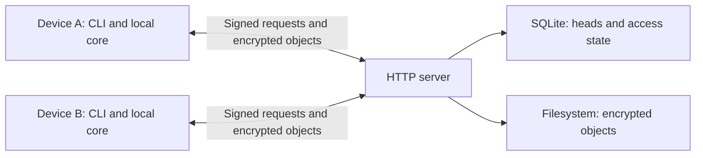

# RustSync

RustSync synchronizes directories between your devices through a server you run.
Devices encrypt file contents and manifests before upload; the server stores
opaque objects and enforces device permissions. Written in Rust, it provides
on-demand synchronization through a CLI and a self-hosted HTTP service.

- Three-way reconciliation propagates edits and deletions, merges compatible
  text changes, and preserves conflicting versions for explicit resolution.
- Unchanged files reuse encrypted blob references and keep their local modification
  times. Large files travel as independently authenticated chunks.
- Ed25519 request signatures identify devices. Owners approve enrollment and
  deliver workspace keys through encrypted recipient envelopes.
- SQLite coordinates workspace revisions and access state. Immutable objects use
  content-addressed filesystem storage with integrity checks and lazy catalog repair.
- Dry runs, JSON reports, transfer counters, and workspace diagnostics support
  inspection and scripting.

## Architecture



Five crates separate the protocol, local workspace engine, HTTP client, CLI,
and server. Each device compares its working tree and the remote snapshot with
its last synchronized base. Publication uses an expected revision so a stale
writer cannot overwrite a newer head. See [architecture](docs/architecture.md)
for the crate map and sync sequence.

## Quick start

Build from source with stable Rust, Cargo, and a native compiler toolchain:

```sh
cargo install --locked --path crates/rustsync-cli
cargo install --locked --path crates/rustsync-server
rustsync-server
```

In another terminal:

```sh
mkdir ./notes
rustsync init ./notes
printf 'Hello from RustSync\n' > ./notes/hello.txt
rustsync sync ./notes
rustsync status ./notes
```

The server defaults to `http://127.0.0.1:3000` and `./server-storage`.
Pass `--server-url URL` to `init` for another address. RustSync saves it in the
workspace for later commands. An explicit flag overrides it for one command.
[Enroll a second device](docs/usage.md#add-another-device) to exchange changes.
Export its connection details with `rustsync invite ./notes --output notes.invite`,
then use `rustsync join notes.invite ./notes` on the new device. After the owner
approves the request, repeat `join` with `--finish` and run `sync`.
The client also installs the compatibility executable `rustsync-cli`.

For a containerized server, run `docker compose up -d` from the repository root.
The root [Compose file](compose.yaml) publishes port 3000 on localhost and retains
server data in a named volume. See [deployment](docs/deployment.md) for configuration,
remote access, and backups.

## Two-device demo

```sh
scripts/demo.sh
```

With Bash, Cargo, curl, and jq installed, this builds the binaries, starts a
temporary server, enrolls two devices, exchanges edits, and resolves a conflict.
It verifies the resulting files and stops its server on exit.
Set `RUSTSYNC_KEEP_DATA=1` to inspect the temporary workspaces afterward.
[Script options](scripts/README.md) cover ports and release builds.

## Security model

XChaCha20-Poly1305 protects file contents and paths in encrypted manifests.
Workspace keys stay on devices; enrollment uses X25519 and HKDF-SHA256 to deliver
keys to approved recipients. The server sees identities, membership, object sizes,
and timing. Use HTTPS or a private tunnel beyond localhost.

Local files, caches, and private keys are readable on the device. Revocation
blocks future authorized server access but cannot erase downloaded data and does
not rotate the shared key. Replay tracking resets on server restart, and
malicious-server rollback protection is incomplete.
Read the [security model](docs/security.md) before trusting a deployment.

## Limitations

RustSync supports regular files and directories with UTF-8 paths. It does not
synchronize permissions, ownership, or extended attributes. Text merging handles
compatible line replacements; inserted or deleted lines can require resolution.

Sync runs manually, with one sync or resolution command at a time per workspace.
Files are chunked, but the client reconstructs whole files in memory and the
encrypted manifest must fit within 1 MiB. There is no history browser, object
garbage-collection command, or automatic format migration.

Whole-directory updates are not atomic, and power-loss durability is not
guaranteed. Keep independent backups. Persisted formats are pre-release;
CI currently exercises Linux. [Usage and recovery](docs/usage.md) explain how to
inspect pending work and resolve conflicts.

## Documentation

[Architecture](docs/architecture.md) · [Usage](docs/usage.md) ·
[CLI reference](docs/cli.md) · [Deployment](docs/deployment.md) ·
[Security](docs/security.md) · [Internals](docs/internals.md) ·
[Development](docs/development.md)

## License

[MIT](LICENSE).
