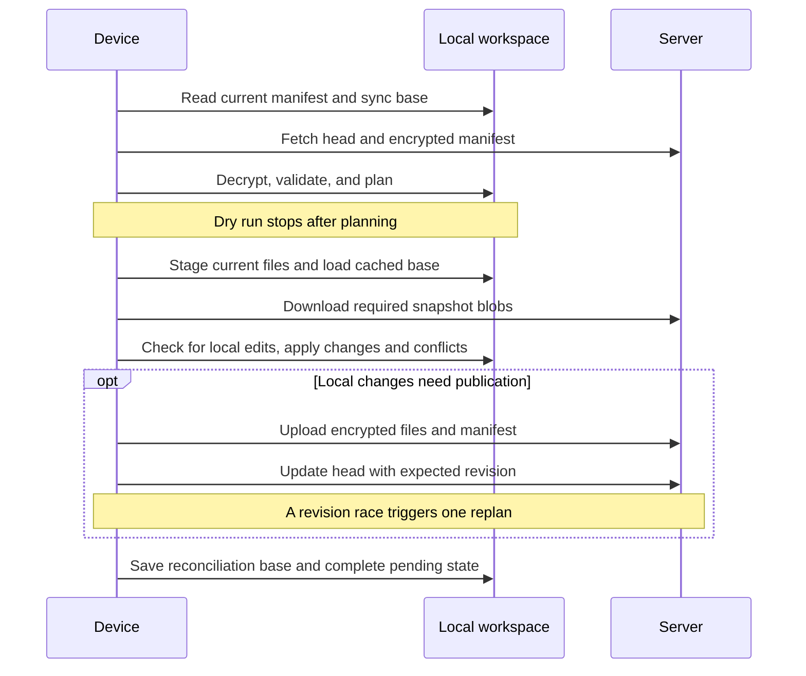

# Architecture

[Documentation](README.md) · [Internals](internals.md)

RustSync separates local reconciliation from HTTP transport and server storage.
A workspace has one remote head and a separate local reconciliation base on each
device. The server authorizes access but never merges or decrypts files.

## Crate responsibilities

| Crate | Owns |
| --- | --- |
| [rustsync-protocol](../crates/rustsync-protocol/src/lib.rs) | IDs, DTOs, access events, roles, signed-request representation, routes, and encrypted-object framing |
| [rustsync-core](../crates/rustsync-core/src/lib.rs) | Local workspace state, manifest building, reconciliation, device identity, key storage, encryption, and key envelopes |
| [rustsync-client](../crates/rustsync-client/src/lib.rs) | Signed HTTP requests, bounded object downloads, timeouts, and server-error mapping |
| [rustsync-cli](../crates/rustsync-cli/src/lib.rs) | Command parsing, enrollment commands, user output, and the sync workflow |
| [rustsync-server](../crates/rustsync-server/src/lib.rs) | HTTP handling, authentication, authorization, replay tracking, SQLite state, and encrypted object storage |

The client crate takes a `RequestSigner`; it does not own private device keys.
The server treats encrypted object bytes as opaque. Decryption and local path
application belong to the device-side code.

## Repository map

```text
crates/
  rustsync-cli/src/       commands/, sync_workflow.rs, sync_workflow/transfer.rs
  rustsync-core/src/      workspace/, manifest/, reconciliation.rs, access/, keyring/
  rustsync-client/src/    client.rs, transport.rs, auth.rs, config.rs
  rustsync-server/src/    api/, auth/, storage/, app.rs, state.rs
  rustsync-server/migrations/  SQLite schema
  rustsync-protocol/src/  api/, auth/, access/, device/, id/, object/, manifest.rs
  */tests/               crate integration suites
scripts/                 executable demo and shared local-server setup
examples/                copyable ignore configuration
docs/                    guides
compose.yaml             canonical container deployment
Dockerfile               server build and runtime image
.github/workflows/       formatting, Clippy, and workspace tests
```

The CLI owns orchestration because reconciliation combines user-selected modes,
network effects, and local filesystem effects. `SyncRemote` lets workflow tests
control races and failures without changing the core planner. `Storage` gives the
HTTP service a common backend interface. The shipped server opens
`IndexedFsStorage`; `FsStorage` is also a library implementation, not a selectable
server CLI backend.

## Sync flow



Start with [sync_workflow.rs](../crates/rustsync-cli/src/sync_workflow.rs) for
orchestration, [reconciliation.rs](../crates/rustsync-core/src/reconciliation.rs)
for planning and text merging, and
[local_engine.rs](../crates/rustsync-core/src/workspace/local_engine.rs) for
staging, cached blobs, validation, and filesystem application.

Publishing a changed snapshot reuses the remote blob references for unchanged
files. Changed files are encrypted and uploaded in chunks; files with identical
contents can reuse references from the synchronized snapshot. Randomized encryption means
this is snapshot-based reuse, not global plaintext deduplication.


## Revisions and failure boundaries

A workspace head names an encrypted manifest and a monotonically incremented
revision. Access state has its own revision for membership and key grants.
Changing a role does not publish file contents. An immutable manifest is uploaded
before the client attempts a conditional head update.

Each device retains a staged manifest, a reconciliation base, and pending sync
state. These represent different points in the workflow. Applying a remote
snapshot can succeed before publication of remaining local changes fails.
`status` and `doctor` expose that pending state; a clean working tree alone does
not prove remote publication. See [internals](internals.md#local-workspace).

The server checks encrypted object integrity and permissions, but cannot inspect
file paths, resolve conflicts, or validate all references inside an encrypted
manifest. Clients validate decrypted snapshots before applying them. The
[security guide](security.md) defines the remaining trust assumptions.
