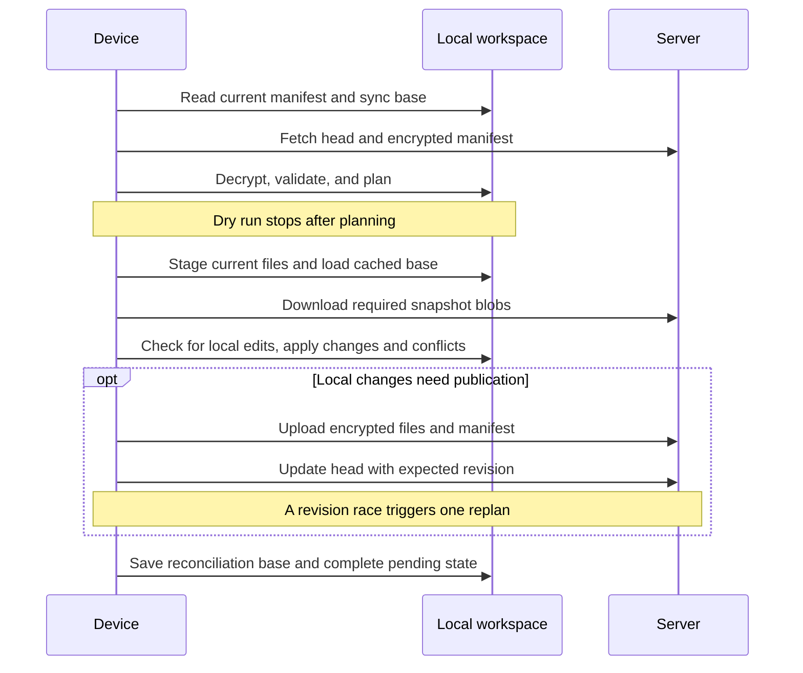

# Architecture

[Documentation](README.md) · [Internals](internals.md)

RustSync separates local reconciliation from HTTP transport and server storage.
A workspace has one remote head and a separate local reconciliation base on each
device. The server authorizes access but never merges or decrypts files.

## Crate responsibilities

| Crate | Owns |
| --- | --- |
| [rustsync-protocol](../crates/rustsync-protocol/src/lib.rs) | IDs, DTOs, access events, roles, signed-request representation, routes, and encrypted-object framing |
| [rustsync-core](../crates/rustsync-core/src/lib.rs) | Local workspace state, manifest building, reconciliation, device identity, key storage, encryption, and key envelopes |
| [rustsync-client](../crates/rustsync-client/src/lib.rs) | Signed HTTP requests, bounded object downloads, timeouts, and server-error mapping |
| [rustsync-cli](../crates/rustsync-cli/src/lib.rs) | Command parsing, enrollment commands, user output, and the sync workflow |
| [rustsync-server](../crates/rustsync-server/src/lib.rs) | HTTP handling, authentication, authorization, replay tracking, SQLite state, and encrypted object storage |

The client crate takes a `RequestSigner`; it does not own private device keys.
The server treats encrypted object bytes as opaque. Decryption and local path
application belong to the device-side code.

## Sync flow

Start with [sync_workflow.rs](../crates/rustsync-cli/src/sync_workflow.rs) for
orchestration, [reconciliation.rs](../crates/rustsync-core/src/reconciliation.rs)
for planning and text merging, and
[local_engine.rs](../crates/rustsync-core/src/workspace/local_engine.rs) for
staging, cached blobs, validation, and filesystem application.

Publishing a changed snapshot reuses the remote blob references for unchanged
files. Changed files are encrypted and uploaded in chunks; files with identical
contents can reuse references from the synchronized snapshot. Randomized encryption means
this is snapshot-based reuse, not global plaintext deduplication. The
[benchmark script](../scripts/benchmark.sh) checks that editing one of 1,000
small files uploads one blob and that unchanged syncs transfer zero blobs.

