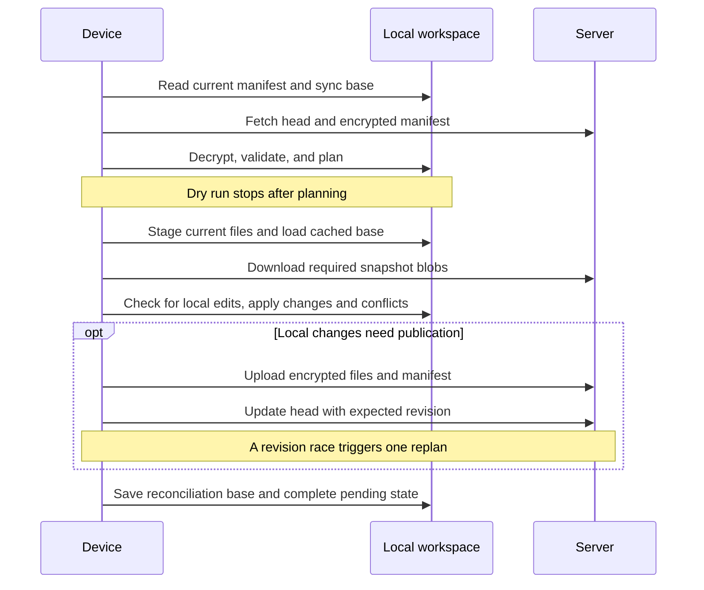

# Development

[README](../README.md) · [Storage reference](storage.md) · [Security](security.md)

## Build and run

Use a Rust toolchain with Cargo and a native compiler toolchain. The workspace
uses edition 2024 and resolver 3. CI follows stable Rust on Linux; no minimum
Rust version is declared or pinned.

From the repository root:

```sh
cargo build --workspace --locked
cargo run --locked -p rustsync-server -- --help
cargo run --locked -p rustsync-cli -- --help
```

`cargo build` creates `target/debug/rustsync-cli` and
`target/debug/rustsync-server`. Add `--release` for optimized binaries under
`target/release/`. On Windows, executable filenames have an `.exe` suffix.

## Crate responsibilities

| Crate | Owns |
| --- | --- |
| [rustsync-protocol](../crates/rustsync-protocol/src/lib.rs) | IDs, DTOs, access events, roles, signed-request representation, routes, and encrypted-object framing |
| [rustsync-core](../crates/rustsync-core/src/lib.rs) | Local workspace state, manifest building, reconciliation, device identity, key storage, encryption, and key envelopes |
| [rustsync-client](../crates/rustsync-client/src/lib.rs) | Signed HTTP requests, bounded object downloads, timeouts, and server-error mapping |
| [rustsync-cli](../crates/rustsync-cli/src/lib.rs) | Command parsing, enrollment commands, user output, and the sync workflow |
| [rustsync-server](../crates/rustsync-server/src/lib.rs) | HTTP handling, authentication, authorization, replay tracking, SQLite state, and encrypted object storage |

The client crate takes a `RequestSigner`; it does not own private device keys.
The server treats encrypted object bytes as opaque. Decryption and local path
application belong to the device-side code.

## Sync flow



Start with [sync_workflow.rs](../crates/rustsync-cli/src/sync_workflow.rs) for
orchestration, [reconciliation.rs](../crates/rustsync-core/src/reconciliation.rs)
for planning and text merging, and
[local_engine.rs](../crates/rustsync-core/src/workspace/local_engine.rs) for
staging, cached blobs, validation, and filesystem application.

Publishing a changed snapshot currently encrypts and uploads its staged file
contents, including unchanged files. Randomized encryption means repeated
plaintext can produce different remote IDs. Do not assume cross-sync deduplication
or delta transfer from the content-addressed storage layout.

## Validation

Run the same checks used for normal development:

```sh
cargo fmt --all -- --check
cargo test --workspace --locked
cargo clippy --workspace --all-targets --all-features --locked -- -D warnings
```

Target the relevant integration suite while working:

```sh
cargo test --locked -p rustsync-cli --test sync_workflow
cargo test --locked -p rustsync-cli --test device_bootstrap_e2e
cargo test --locked -p rustsync-core --test local_workspace_engine
cargo test --locked -p rustsync-server --test http
cargo test --locked -p rustsync-server --test storage
```

The sync workflow tests use real local files and encryption with a controlled
remote implementation for failures and races. The device bootstrap test runs
against a local HTTP server and exercises enrollment, two-device merging, and
deletion-conflict resolution. Storage tests cover corruption, restart repair,
root locking, and concurrent publication. HTTP tests cover signatures,
permissions, replay rejection, body limits, and opaque object transfer.

Generate crate API documentation locally:

```sh
cargo doc --workspace --no-deps --locked
```

The device bootstrap scenario uses `IndexedFsStorage`, matching the shipped
server. `multi_device_process_e2e` runs fresh CLI processes against a separate
server application process, kills and restarts that process, then verifies
merges, deletion, persisted revisions, and repeated no-op syncs. Client nonce
tests also launch eight processes and check every generated value for reuse.

## Making changes

Reproduce bugs with a focused regression test, then run the affected suite and
the workspace checks. For sync changes, verify deletions and conflict copies as
well as successful transfers. For storage changes, test interrupted publication,
reopening data, and corruption reporting.

Changing an internal helper does not automatically mean adding a CLI command.
Keep the command reference aligned with the actual parser. When changing stored
data or wire formats, update the storage reference and state whether existing
development data must be replaced.

The repository currently has no automated binary-release workflow. Build and
install the binaries from source.
